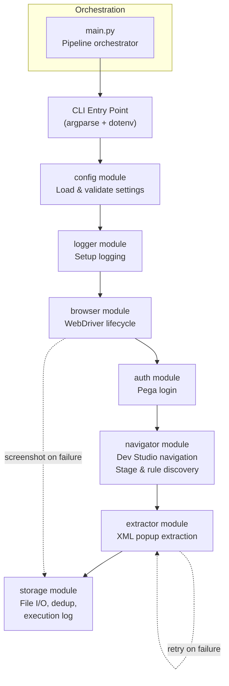
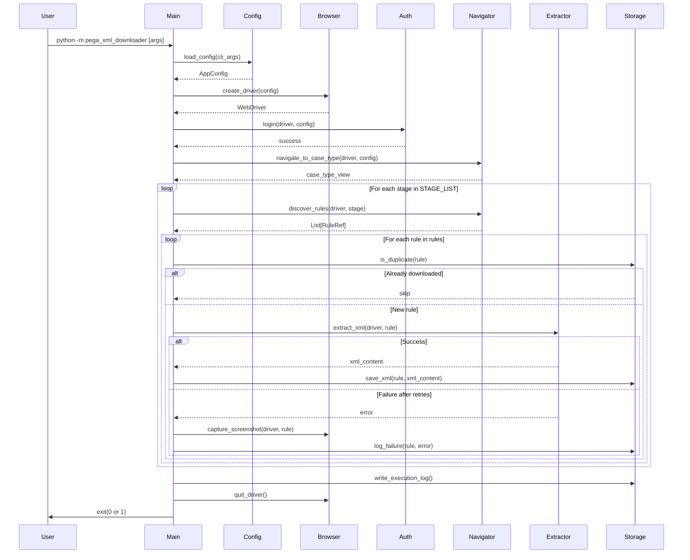

# Design Document: Pega XML Downloader

## Overview

The Pega XML Downloader is a production-ready Python CLI tool that automates the extraction of rule XML definitions from the Pega Platform UI. It uses Selenium WebDriver to drive a Chrome browser session through the Pega Dev Studio interface, systematically discovering and downloading XML for every rule across all configured stages of a target Case Type.

The tool is designed for reliability over speed: it handles transient UI failures with exponential-backoff retries, prevents duplicate downloads across re-runs, captures diagnostic screenshots on failure, and produces a structured execution log. It supports headless operation, `.env`-based configuration, and CLI argument overrides.

### Key Design Decisions

1. **Selenium over API**: Pega does not expose a public REST API for bulk rule XML export. The "View XML" popup in Dev Studio is the only supported extraction path, making browser automation the necessary approach.

2. **Sequential-first with optional parallelism**: The default mode is single-threaded sequential processing. Parallel mode (multiple browser sessions) is opt-in via `PARALLEL_WORKERS` because Pega UI sessions can be resource-intensive and concurrent access may trigger rate limiting.

3. **Explicit waits only**: All synchronization uses `WebDriverWait` with expected conditions. No `time.sleep` calls. This makes the script adaptive to varying page load times rather than relying on fixed delays.

4. **Collect-then-process pattern**: For each stage, all rules are discovered and collected into a list before any individual rule is opened. This avoids DOM mutation issues where opening a rule could change the stage's rule list.

5. **Idempotent re-runs**: Duplicate detection via filesystem checks and in-memory tracking means the script can be safely re-run after a partial failure without re-downloading already-captured rules.

## Architecture

The system follows a pipeline architecture where each module handles a distinct responsibility. The `main` orchestrator drives the pipeline sequentially, with error boundaries at each stage.



### Execution Flow



## Components and Interfaces

### Module: `config`

**File**: `pega_xml_downloader/config.py`

Responsible for loading, merging, and validating all configuration from `.env` files, environment variables, and CLI arguments.

```python
from dataclasses import dataclass, field
from typing import List, Optional

@dataclass(frozen=True)
class AppConfig:
    """Immutable application configuration."""
    pega_url: str
    pega_username: str
    pega_password: str
    output_dir: str = "output"
    headless: bool = True
    max_retries: int = 3
    stage_list: List[str] = field(default_factory=lambda: ["Initialization", "Primary", "Alternatives"])
    parallel_workers: int = 1
    log_level: str = "INFO"
    case_type_name: str = "Tax Compliance Training"

def load_config(cli_args: Optional[dict] = None) -> AppConfig:
    """
    Load configuration with precedence: CLI args > env vars > .env file > defaults.
    Raises SystemExit if required fields are missing.
    """
    ...

def parse_cli_args() -> dict:
    """Parse CLI arguments using argparse. Returns dict of provided args."""
    ...

def sanitize_filename(name: str) -> str:
    """
    Replace spaces with underscores and remove filesystem-unsafe characters.
    Returns a safe filename string.
    """
    ...
```

### Module: `logger`

**File**: `pega_xml_downloader/logger.py`

Sets up dual-output logging (stdout + file) with configurable level.

```python
import logging

def setup_logging(log_level: str, output_dir: str) -> logging.Logger:
    """
    Configure root logger with:
    - StreamHandler for stdout
    - FileHandler for {output_dir}/downloader.log
    - Format: %(asctime)s - %(levelname)s - %(name)s - %(message)s
    Returns the configured logger.
    """
    ...
```

### Module: `browser`

**File**: `pega_xml_downloader/browser.py`

Manages WebDriver lifecycle, screenshot capture, and window switching.

```python
from selenium.webdriver import Chrome
from pega_xml_downloader.config import AppConfig

def create_driver(config: AppConfig) -> Chrome:
    """
    Create and configure a Chrome WebDriver instance.
    - Headless mode based on config.headless
    - Page load timeout: 60s
    - Implicit wait: 0s
    Raises SystemExit on initialization failure.
    """
    ...

def capture_screenshot(driver: Chrome, output_dir: str, label: str) -> Optional[str]:
    """
    Save a screenshot to {output_dir}/FAILED_{label}_{timestamp}.png.
    Returns the file path on success, None on failure.
    """
    ...

def switch_to_popup(driver: Chrome, timeout: int = 15) -> str:
    """
    Wait for a new window handle and switch to it.
    Returns the popup window handle.
    Raises TimeoutError if no new window appears within timeout.
    """
    ...

def switch_to_main(driver: Chrome, main_handle: str) -> None:
    """Close current window and switch back to the main window handle."""
    ...

def quit_driver(driver: Chrome) -> None:
    """Safely quit the WebDriver, logging any errors."""
    ...
```

### Module: `auth`

**File**: `pega_xml_downloader/auth.py`

Handles Pega login flow with explicit waits.

```python
from selenium.webdriver import Chrome
from pega_xml_downloader.config import AppConfig

def login(driver: Chrome, config: AppConfig) -> None:
    """
    Navigate to PEGA_URL, enter credentials, submit login form.
    Waits up to 30s for authenticated state.
    Raises AuthenticationError on failure (captures screenshot).
    Uses stable selectors (not dynamic IDs).
    """
    ...

class AuthenticationError(Exception):
    """Raised when Pega login fails."""
    pass
```

### Module: `navigator`

**File**: `pega_xml_downloader/navigator.py`

Handles all Dev Studio navigation and rule/stage discovery.

```python
from dataclasses import dataclass
from typing import List
from selenium.webdriver import Chrome

@dataclass
class RuleRef:
    """Reference to a discovered rule within a stage."""
    name: str
    stage_name: str
    locator: str  # CSS selector or XPath to re-locate the rule element
    index: int    # Position index within the stage's rule list

def navigate_to_case_type(driver: Chrome, case_type_name: str) -> None:
    """
    Navigate from authenticated session to the Case Type detail view.
    Steps: Dev Studio → Case Types → locate target → Actions → Open.
    Raises NavigationError if Case Type not found.
    """
    ...

def discover_stages(driver: Chrome, stage_list: List[str]) -> List[str]:
    """
    Within the Case Type detail view, identify which stages from
    stage_list are present. Returns list of found stage names.
    Logs WARNING for any stage in stage_list not found.
    """
    ...

def discover_rules(driver: Chrome, stage_name: str) -> List[RuleRef]:
    """
    Open/expand a stage and collect ALL rule references.
    Collects the complete list before returning.
    Returns list of RuleRef objects.
    """
    ...

class NavigationError(Exception):
    """Raised when a required navigation target is not found."""
    pass
```

### Module: `extractor`

**File**: `pega_xml_downloader/extractor.py`

Handles the XML extraction workflow for a single rule, including retry logic.

```python
from pega_xml_downloader.navigator import RuleRef
from selenium.webdriver import Chrome

@dataclass
class ExtractionResult:
    """Result of an XML extraction attempt."""
    rule_ref: RuleRef
    success: bool
    xml_content: Optional[str] = None
    error_message: Optional[str] = None
    attempts: int = 1

def extract_rule_xml(
    driver: Chrome,
    rule_ref: RuleRef,
    max_retries: int,
    main_window_handle: str
) -> ExtractionResult:
    """
    Open a rule's Actions → View XML popup, extract XML content.
    Retries up to max_retries with exponential backoff (2s, 4s, 8s... max 30s).
    Returns ExtractionResult with success/failure details.
    """
    ...

def _attempt_extraction(driver: Chrome, rule_ref: RuleRef, main_handle: str) -> str:
    """
    Single extraction attempt. Clicks Actions → View XML, switches to popup,
    reads XML content, closes popup, returns to main window.
    Raises ExtractionError on failure.
    """
    ...

class ExtractionError(Exception):
    """Raised when XML extraction from a rule fails."""
    pass
```

### Module: `storage`

**File**: `pega_xml_downloader/storage.py`

Handles file I/O, duplicate detection, and execution log management.

```python
from dataclasses import dataclass
from typing import Set, List, Optional
import json

@dataclass
class LogEntry:
    """Single entry in the execution log."""
    rule_name: str
    stage_name: str
    output_filename: str
    status: str  # "success" or "failure"
    timestamp: str  # ISO 8601
    failure_reason: Optional[str] = None

class StorageManager:
    """Manages file output, dedup tracking, and execution logging."""
    
    def __init__(self, output_dir: str, case_type_name: str):
        self._output_dir = output_dir
        self._case_type_name = case_type_name
        self._processed: Set[str] = set()
        self._log_entries: List[LogEntry] = []
    
    def ensure_output_dir(self) -> None:
        """Create output directory and subdirectories if they don't exist."""
        ...
    
    def build_filename(self, stage_name: str, rule_name: str) -> str:
        """
        Build filename: {CaseType}_{Stage}_{RuleName}.xml
        Spaces → underscores, unsafe chars removed.
        """
        ...
    
    def is_duplicate(self, filename: str) -> bool:
        """
        Check if filename exists on disk OR in the in-memory processed set.
        Returns True if already downloaded.
        """
        ...
    
    def save_xml(self, filename: str, content: str) -> str:
        """
        Write XML content to file with UTF-8 encoding.
        Adds filename to processed set.
        Returns full file path.
        Raises IOError on filesystem failure.
        """
        ...
    
    def record_result(self, entry: LogEntry) -> None:
        """Add a log entry to the in-memory execution log."""
        ...
    
    def write_execution_log(self) -> str:
        """
        Write all log entries to {output_dir}/execution_log.jsonl
        in JSON Lines format. Returns file path.
        """
        ...
    
    def get_summary(self) -> dict:
        """
        Return summary dict with total_rules, successful, failed counts.
        """
        ...
```

### Module: `main`

**File**: `pega_xml_downloader/main.py`

Top-level orchestrator that wires all modules together.

```python
def main() -> int:
    """
    Main entry point. Orchestrates the full pipeline:
    1. Load config (CLI + env + .env)
    2. Setup logging
    3. Create output directory
    4. Launch browser
    5. Authenticate
    6. Navigate to Case Type
    7. For each stage: discover rules, extract XML for each
    8. Write execution log
    9. Cleanup and exit
    
    Returns 0 on success (all rules downloaded), 1 if any failures occurred.
    Catches all unhandled exceptions at this level.
    """
    ...
```

### Package Entry Point

**File**: `pega_xml_downloader/__main__.py`

```python
from pega_xml_downloader.main import main
import sys

if __name__ == "__main__":
    sys.exit(main())
```

## Data Models

### Configuration Data

| Field | Type | Source | Default | Description |
|-------|------|--------|---------|-------------|
| `pega_url` | `str` | `PEGA_URL` env / `--url` CLI | (required) | Base URL of Pega instance |
| `pega_username` | `str` | `PEGA_USERNAME` env | (required) | Login username |
| `pega_password` | `str` | `PEGA_PASSWORD` env | (required) | Login password |
| `output_dir` | `str` | `OUTPUT_DIR` env / `--output-dir` CLI | `"output"` | Directory for all output files |
| `headless` | `bool` | `HEADLESS` env / `--headless` CLI | `True` | Run Chrome in headless mode |
| `max_retries` | `int` | `MAX_RETRIES` env / `--max-retries` CLI | `3` | Max retry attempts per rule |
| `stage_list` | `List[str]` | `STAGE_LIST` env / `--stages` CLI | `["Initialization", "Primary", "Alternatives"]` | Ordered list of stages to process |
| `parallel_workers` | `int` | `PARALLEL_WORKERS` env | `1` | Number of concurrent browser sessions |
| `log_level` | `str` | `LOG_LEVEL` env | `"INFO"` | Python logging level |
| `case_type_name` | `str` | — | `"Tax Compliance Training"` | Target Case Type name |

### RuleRef

| Field | Type | Description |
|-------|------|-------------|
| `name` | `str` | Display name of the rule |
| `stage_name` | `str` | Name of the parent stage |
| `locator` | `str` | CSS/XPath selector to re-locate the rule element |
| `index` | `int` | Position index within the stage |

### ExtractionResult

| Field | Type | Description |
|-------|------|-------------|
| `rule_ref` | `RuleRef` | Reference to the rule that was processed |
| `success` | `bool` | Whether extraction succeeded |
| `xml_content` | `Optional[str]` | Extracted XML text (None on failure) |
| `error_message` | `Optional[str]` | Error description (None on success) |
| `attempts` | `int` | Number of attempts made |

### LogEntry (Execution Log)

| Field | Type | Description |
|-------|------|-------------|
| `rule_name` | `str` | Name of the rule |
| `stage_name` | `str` | Name of the parent stage |
| `output_filename` | `str` | Expected output filename |
| `status` | `str` | `"success"` or `"failure"` |
| `timestamp` | `str` | ISO 8601 timestamp |
| `failure_reason` | `Optional[str]` | Error description if failed |

### Output File Structure

```
output/
├── Tax_Compliance_Training_Initialization_Program_Design.xml
├── Tax_Compliance_Training_Initialization_Another_Rule.xml
├── Tax_Compliance_Training_Primary_Some_Flow.xml
├── ...
├── FAILED_Tax_Compliance_Training_Primary_Broken_Rule_20240115T143022.png
├── execution_log.jsonl
└── downloader.log
```

### Execution Log Format (JSON Lines)

Each line is a self-contained JSON object:

```json
{"rule_name": "Program Design", "stage_name": "Initialization", "output_filename": "Tax_Compliance_Training_Initialization_Program_Design.xml", "status": "success", "timestamp": "2024-01-15T14:30:22.123456", "failure_reason": null}
{"rule_name": "Broken Rule", "stage_name": "Primary", "output_filename": "Tax_Compliance_Training_Primary_Broken_Rule.xml", "status": "failure", "timestamp": "2024-01-15T14:31:05.654321", "failure_reason": "XML popup did not open within 15 seconds after 3 attempts"}
```

